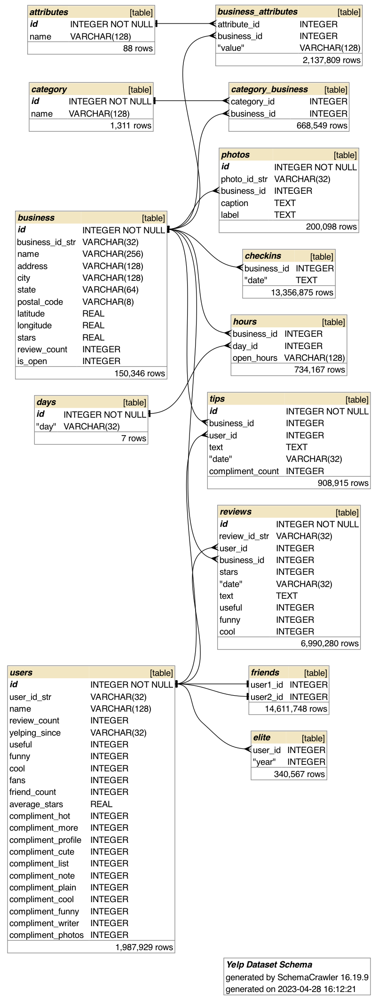

# Yelp database in sqlite using SQLAlchemy and Python
Create a sqlite database of the Yelp open dataset found here: https://www.yelp.com/dataset

## The structure of the relational database:



## To implement:
#### Required files:
`business.json`, `users.json`, `reviews.json`
#### optional files
`checkin.json`, `tips.json`, `photos.json`
#### create a .yaml file with the following:
```yaml
database:
    database_file_path:
        path_to_database_file
    raw_data_folder_path:
        path_to_raw_data_folder
```
#### run from the command line:
```
python database.py path_to_yaml_file
```

#### to see options:
```
python database.py -h
```

#### then use in sqlite browser or in python notebook or file.

#### python example:
```py
from database import YelpDataBase
ydb = YelpDataBase(path_to_config_yaml_file)

statement = """SELECT * FROM users"""
ydb.execute_sql_statement(statement, as_frame=True)
```